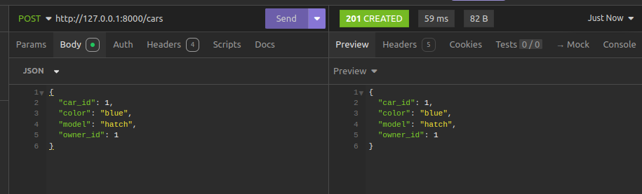
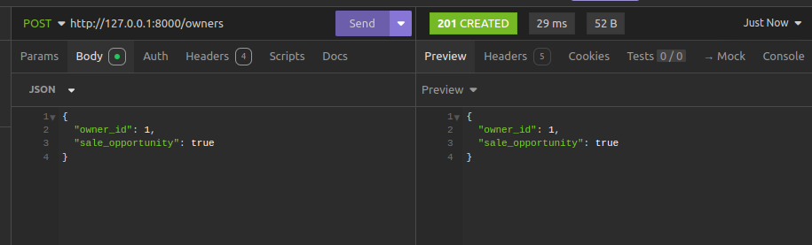
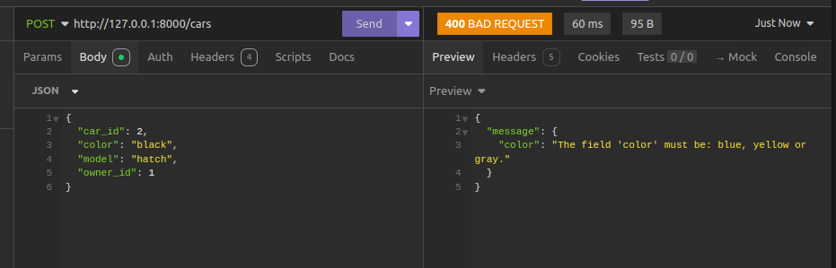
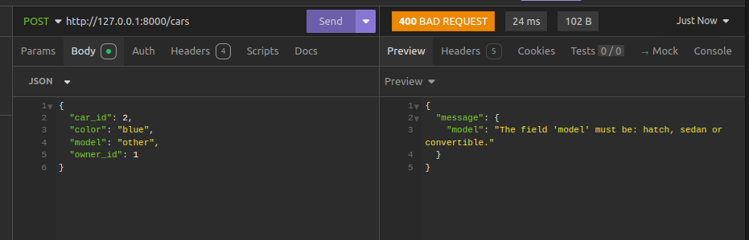
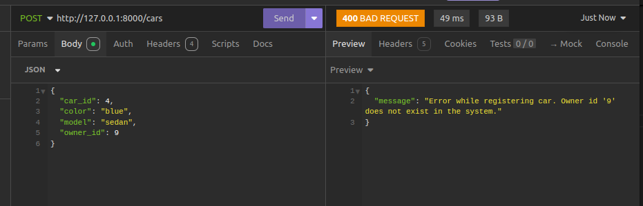
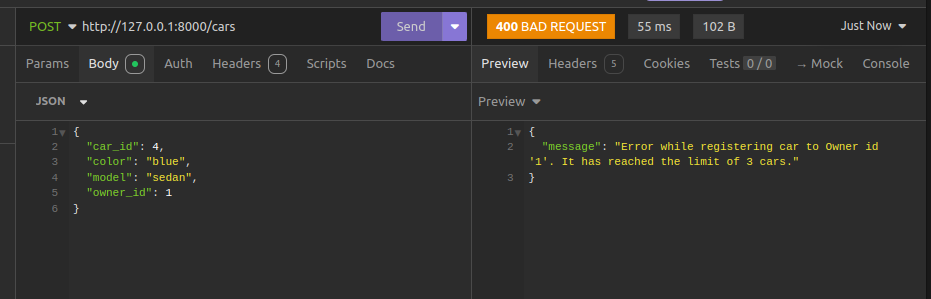

<ul>

  <h1>Carford System</h1>

  <li>
    <h2>About this project</h2>
  
    Project developed as AdviceHealth technical test.

    BRIEFING:

    Nork-Town is a weird place. Crows cawk the misty morning while old men squint. 
    It’s a smalltown, so the mayor had a bright idea to limit the number of cars a person may possess.
    One person may have up to 3 vehicles. The vehicle, registered to a person, may have one color,
    ‘yellow’, ‘blue’ or ‘gray’. And one of three models, ‘hatch’, ‘sedan’ or ‘convertible’.
    Carford car shop want a system where they can add car owners and cars. 
    Car owners may not have cars yet, they need to be marked as a sale opportunity.
    Cars cannot exist in the system without owners.

 </li>
  
   
  
  <li>
  <h3> Technologies </h3>
  This project's been developed using the following technologies:
  <ul>
     
    <li>Flask</a></li>
    <li>PostgreSQL</a></li>
    <li>Docker</a></li>
    <li>Docker Compose</a></li>
  </ul>
  </li>
  
   
  
  <li>
    <h3>Run the application</h3> 
    <ol>
      <li> First, check if you have <b>Docker</b> and <b>Docker Compose</b> properly installed in your environment;</li> 
      <li> 
        Then, run the following command:  
               
        $ docker compose up
   </li>

    
   <li> Once the application is running it will be possible make http calls to add and get cars and owners. 
            
            
            
   </li> 

   <li> The system will verify if the conditions are met before saving information in the database. For example:
            
            
            
            
  </li> 

  </ol>
  </li>
  
  <li>
    <h3>Test the application</h3> 
    <ol>
      <li>Due to the time available to develop the project, the unit tests are still under construction</li> 
      <li>The container and the configurations were setup for this purpose, also the initial tests.</li> 
      <li> 
        Execute the command below to run the tests:  
               
        $ docker compose up tests
   </li>

  
</ul>

